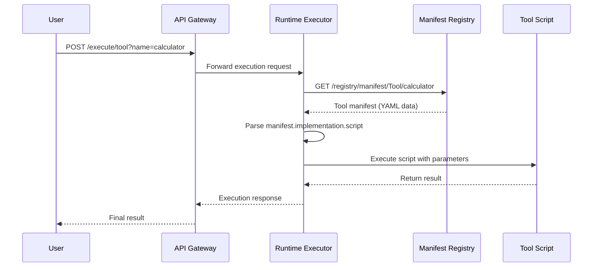
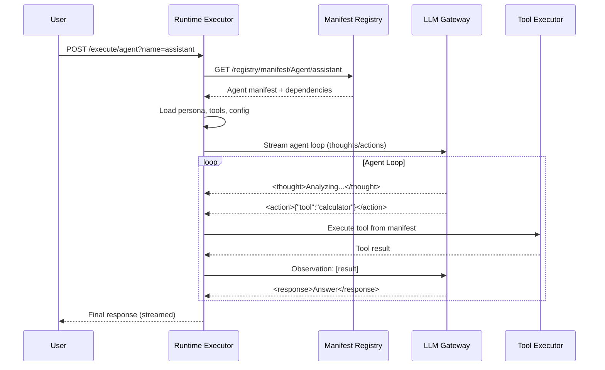
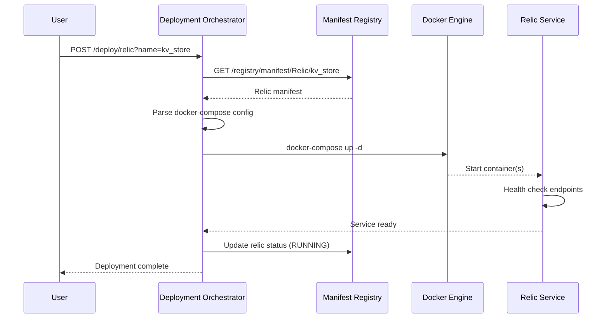
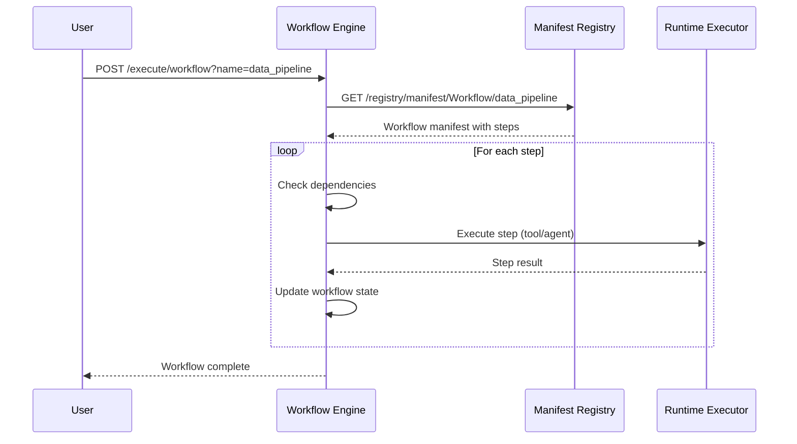
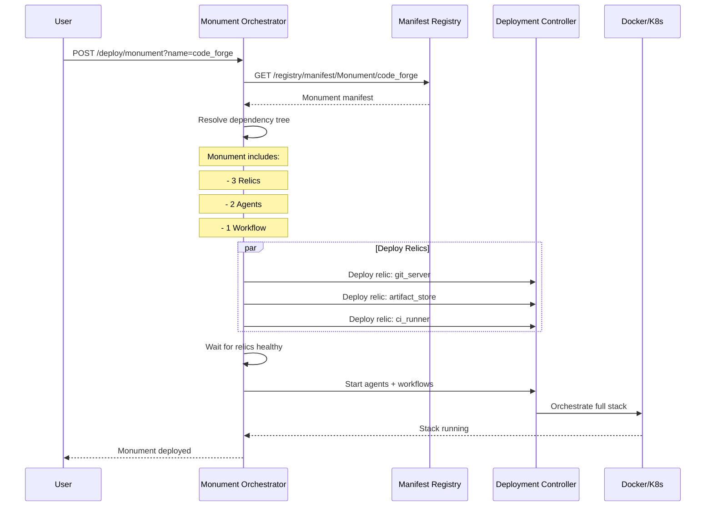

# Manifest Interaction Model
## How Manifests Flow Through Cortex-Prime MK1

**Version:** 1.0  
**Status:** Design Specification  
**Author:** PRAETORIAN_CHIMERA  
**Date:** 2025-01-15

---

## Table of Contents

1. [Philosophy](#philosophy)
2. [Current Architecture](#current-architecture)
3. [Interaction Lifecycle](#interaction-lifecycle)
4. [API Patterns](#api-patterns)
5. [Service Orchestration](#service-orchestration)
6. [Deployment Strategies](#deployment-strategies)
7. [Implementation Roadmap](#implementation-roadmap)

---

## Philosophy

**Manifests are not just configuration files** - they are executable, composable specifications that define the entire behavior and deployment of entities within Cortex-Prime.

**Core Principles:**
- **Declarative Intent**: Manifests declare what should exist, not how to build it
- **Hot Execution**: Manifests can be executed immediately after ingestion
- **Fractal Composition**: Manifests reference other manifests, creating dependency graphs
- **Runtime Polymorphism**: Same manifest can execute in different runtimes (local, Docker, K8s)
- **State Awareness**: Execution context flows through manifest layers

---

## Current Architecture

### Phase 1: Ingestion (✅ IMPLEMENTED)

```
┌─────────────────────────────────────────────────────────────┐
│ MANIFEST INGESTION SERVICE (Port 8082)                      │
├─────────────────────────────────────────────────────────────┤
│                                                             │
│  1. Filesystem Watcher (Hot-Reload)                        │
│     ↓                                                       │
│  2. YAML/Markdown Parser                                   │
│     ↓                                                       │
│  3. Pydantic Schema Validation                             │
│     ↓                                                       │
│  4. Dependency Resolution                                  │
│     ↓                                                       │
│  5. In-Memory Registry Storage                             │
│     ↓                                                       │
│  6. RESTful API Exposure                                   │
│                                                             │
└─────────────────────────────────────────────────────────────┘
```

**Current Capabilities:**
- ✅ Parse and validate manifests
- ✅ Store in registry with dependency tracking
- ✅ Hot-reload on filesystem changes
- ✅ Query API for manifest retrieval
- ✅ Export dependency graphs

**Current Limitations:**
- ❌ No execution orchestration
- ❌ No lifecycle management (start/stop/restart)
- ❌ No state persistence beyond memory
- ❌ No container deployment automation

### Phase 2: Execution (🚧 PARTIAL)

```
┌─────────────────────────────────────────────────────────────┐
│ RUNTIME EXECUTOR SERVICE (Port 8083)                        │
├─────────────────────────────────────────────────────────────┤
│                                                             │
│  1. Fetch Manifest from Registry                           │
│     ↓                                                       │
│  2. Determine Runtime Type (Python/Shell/Docker)           │
│     ↓                                                       │
│  3. Execute in Sandboxed Environment                       │
│     ↓                                                       │
│  4. Stream Results (Streaming Protocol)                    │
│     ↓                                                       │
│  5. Store Execution History                                │
│                                                             │
└─────────────────────────────────────────────────────────────┘
```

**Current Capabilities:**
- ✅ Execute Tools (Python/Shell scripts)
- ✅ Execute Agents (with streaming protocol)
- ✅ Track execution history
- ✅ Resource monitoring

**Current Limitations:**
- ❌ No Relic deployment (Docker services)
- ❌ No Monument orchestration (multi-service stacks)
- ❌ No workflow execution engine
- ❌ Limited inter-service communication

---

## Interaction Lifecycle

### Tool Execution Flow



**Key Points:**
1. Manifest is fetched on-demand (not pre-loaded)
2. Script path resolved from manifest
3. Execution is isolated and sandboxed
4. Results are tracked in execution registry

### Agent Execution Flow



**Key Points:**
1. Agent manifest includes persona, tools, and cognitive config
2. Tools are resolved from dependencies
3. LLM gateway provides streaming execution
4. Execution follows streaming protocol v1.1

### Relic Deployment Flow (⚠️ NOT IMPLEMENTED)

**Desired Flow:**



**Required Components:**
- Deployment Orchestrator service (NEW)
- Relic lifecycle manager
- Service discovery integration
- Health monitoring

### Workflow Execution Flow (⚠️ NOT IMPLEMENTED)

**Desired Flow:**



**Required Components:**
- Workflow execution engine
- DAG scheduler for parallel steps
- State persistence (Redis/PostgreSQL)
- Error recovery and retry logic

### Monument Stack Deployment (⚠️ NOT IMPLEMENTED)

**Desired Flow:**



**Required Components:**
- Monument orchestrator
- Multi-service deployment controller
- Service mesh / network configuration
- Stack health monitoring

---

## API Patterns

### User-Facing Interaction APIs

#### Pattern 1: Execute by Name (Recommended)

```bash
# Execute a tool
curl -X POST http://localhost:8083/execute/tool \
  -H "Content-Type: application/json" \
  -d '{
    "name": "calculator",
    "parameters": {"operation": "add", "a": 5, "b": 3}
  }'

# Execute an agent
curl -X POST http://localhost:8083/execute/agent \
  -H "Content-Type: application/json" \
  -d '{
    "name": "assistant",
    "input": {"query": "What is 42 + 8?"}
  }'

# Execute a workflow
curl -X POST http://localhost:8083/execute/workflow \
  -H "Content-Type: application/json" \
  -d '{
    "name": "data_pipeline",
    "input": {"source": "data.csv"}
  }'
```

**Benefits:**
- Simple, intuitive API
- Manifest lookup handled internally
- Execution context auto-generated

#### Pattern 2: Deploy Managed Services

```bash
# Deploy a relic
curl -X POST http://localhost:8084/deploy/relic \
  -H "Content-Type: application/json" \
  -d '{
    "name": "kv_store",
    "auto_start": true
  }'

# Check relic status
curl http://localhost:8084/relics/kv_store/status

# Stop a relic
curl -X POST http://localhost:8084/relics/kv_store/stop
```

**Benefits:**
- Lifecycle management (start/stop/restart)
- Health monitoring
- Service discovery integration

#### Pattern 3: Deploy Monument Stacks

```bash
# Deploy entire stack
curl -X POST http://localhost:8084/deploy/monument \
  -H "Content-Type: application/json" \
  -d '{
    "name": "code_forge",
    "environment": "production"
  }'

# Monitor stack health
curl http://localhost:8084/monuments/code_forge/health

# Scale services
curl -X POST http://localhost:8084/monuments/code_forge/scale \
  -d '{"service": "ci_runner", "replicas": 3}'
```

**Benefits:**
- Single-command deployment
- Environment-specific configs
- Unified monitoring

### Internal Service-to-Service APIs

```bash
# Runtime → Manifest Registry
GET  /registry/manifest/{kind}/{name}
GET  /registry/dependencies/{kind}/{name}
POST /registry/validate-dependencies/{kind}/{name}

# Deployment Controller → Runtime Executor  
POST /execute/tool?manifest_id={id}
POST /execute/agent?manifest_id={id}

# Workflow Engine → Runtime Executor
POST /execute/batch
  - Executes multiple entities in parallel
  - Returns consolidated results
```

---

## Service Orchestration

### Required New Services

#### 1. Deployment Controller Service (HIGH PRIORITY)

**Purpose:** Manages lifecycle of containerized Relics and Monuments

**Port:** 8084

**Responsibilities:**
- Parse Relic manifests with docker-compose configs
- Orchestrate docker-compose up/down operations
- Monitor container health
- Service discovery registration (Redis/Consul)
- Log aggregation

**API Endpoints:**
```
POST   /deploy/relic/{name}
POST   /deploy/monument/{name}
GET    /relics/{name}/status
POST   /relics/{name}/stop
POST   /relics/{name}/restart
DELETE /relics/{name}
GET    /monuments/{name}/health
POST   /monuments/{name}/scale
```

#### 2. Workflow Engine Service (MEDIUM PRIORITY)

**Purpose:** Orchestrates multi-step workflows defined in manifests

**Port:** 8085

**Responsibilities:**
- Parse Workflow manifests
- Build execution DAG
- Schedule parallel steps
- Handle retries and error recovery
- State persistence

**API Endpoints:**
```
POST   /execute/workflow/{name}
GET    /workflows/{execution_id}/status
POST   /workflows/{execution_id}/pause
POST   /workflows/{execution_id}/resume
POST   /workflows/{execution_id}/cancel
GET    /workflows/{execution_id}/logs
```

#### 3. State Management Service (MEDIUM PRIORITY)

**Purpose:** Persist execution state, agent memory, and context

**Port:** 8086

**Responsibilities:**
- Agent conversation history
- Workflow execution state
- Tool execution cache
- Neo4j integration for knowledge graphs
- Redis for hot state

**API Endpoints:**
```
GET    /state/agent/{agent_id}/sessions
POST   /state/agent/{agent_id}/session
GET    /state/workflow/{workflow_id}/checkpoints
POST   /state/workflow/{workflow_id}/checkpoint
GET    /knowledge/{entity_id}/graph
```

### Service Dependency Graph

```
┌─────────────────┐
│  User/Client    │
└────────┬────────┘
         │
         ▼
┌─────────────────────────────────────────────────────────┐
│              API Gateway (8080)                         │
│  - Authentication                                       │
│  - Rate limiting                                        │
│  - Request routing                                      │
└──────┬──────────────────────────────────────────────────┘
       │
       ├─────────────┬──────────────┬─────────────────┐
       │             │              │                 │
       ▼             ▼              ▼                 ▼
┌──────────┐  ┌────────────┐  ┌──────────┐  ┌──────────────┐
│ Manifest │  │  Runtime   │  │Deployment│  │  Workflow    │
│Ingestion │  │  Executor  │  │Controller│  │   Engine     │
│  (8082)  │  │   (8083)   │  │  (8084)  │  │   (8085)     │
└─────┬────┘  └──────┬─────┘  └────┬─────┘  └──────┬───────┘
      │              │              │                │
      │              │              │                │
      ▼              ▼              ▼                ▼
┌────────────────────────────────────────────────────────┐
│           Infrastructure Services                      │
│  ┌──────────┐  ┌──────────┐  ┌──────────┐            │
│  │  Neo4j   │  │  Redis   │  │PostgreSQL│            │
│  │  (7687)  │  │  (6379)  │  │  (5432)  │            │
│  └──────────┘  └──────────┘  └──────────┘            │
└────────────────────────────────────────────────────────┘
```

---

## Deployment Strategies

### Strategy 1: Embedded Tools (Current ✅)

**Use Case:** Simple Python/Shell scripts

**Manifest Example:**
```yaml
kind: Tool
name: calculator
implementation:
  type: python
  script: ./scripts/calculator.py
```

**Deployment:**
- Script stored in repository
- Executed by runtime_executor in isolated subprocess
- No container overhead

**Pros:**
- Fast execution
- Low resource usage
- Easy debugging

**Cons:**
- Limited isolation
- No service persistence
- Shared dependencies

### Strategy 2: Relic Services (Planned 🚧)

**Use Case:** Long-running services with APIs

**Manifest Example:**
```yaml
kind: Relic
name: kv_store
service:
  type: docker-compose
  compose_file: ./docker-compose.yml
  health_check: "http://localhost:8004/health"
endpoints:
  read: "http://kv_store:8004/get"
  write: "http://kv_store:8004/set"
```

**Deployment:**
1. Deployment controller reads manifest
2. Executes docker-compose up
3. Waits for health check
4. Registers endpoints in service registry (Redis)
5. Monitors container status

**Pros:**
- Full isolation
- Persistent services
- Scalable

**Cons:**
- Container overhead
- Requires Docker
- Network complexity

### Strategy 3: Monument Stacks (Planned 🔮)

**Use Case:** Complete multi-service applications

**Manifest Example:**
```yaml
kind: Monument
name: code_forge
components:
  relics:
    - git_server
    - artifact_store
    - ci_runner
  agents:
    - code_reviewer
    - documentation_generator
  workflows:
    - ci_pipeline
networking:
  internal: "code_forge_network"
  exposed_ports:
    - "git_server:22"
    - "artifact_store:8080"
```

**Deployment:**
1. Monument orchestrator resolves dependency tree
2. Deploys relics in parallel (with dependency ordering)
3. Waits for all health checks
4. Starts agents (connect to relics via service discovery)
5. Registers workflows with workflow engine
6. Exposes unified monitoring dashboard

**Pros:**
- Single-command deployment
- Automatic orchestration
- Unified lifecycle

**Cons:**
- Complex setup
- Resource intensive
- Debugging difficulty

### Strategy 4: Kubernetes-Native (Future 🌟)

**Use Case:** Production-scale deployments

**Manifest Example:**
```yaml
kind: Monument
name: code_forge
deployment:
  platform: kubernetes
  namespace: cortex-production
  replicas:
    git_server: 1
    artifact_store: 3
    ci_runner: 5
  resources:
    requests:
      memory: "512Mi"
      cpu: "500m"
    limits:
      memory: "1Gi"
      cpu: "1000m"
```

**Deployment:**
1. Generate Helm chart from manifest
2. Apply to K8s cluster
3. Service mesh integration (Istio/Linkerd)
4. Auto-scaling policies
5. Distributed tracing

---

## Implementation Roadmap

### Phase 0: Foundation (Current State)
- [x] Manifest ingestion service
- [x] Basic runtime executor
- [x] Tool execution
- [x] Agent execution (streaming protocol)
- [x] In-memory registry

### Phase 1: Service Orchestration (Next 2-4 weeks)
- [ ] **Deployment Controller Service** (NEW)
  - Relic deployment via docker-compose
  - Container lifecycle management
  - Health monitoring
  - Service registry integration
- [ ] **Enhanced Runtime Executor**
  - Workflow execution support
  - Parallel execution engine
  - Resource limit enforcement
- [ ] **State Management Service** (NEW)
  - Redis integration for hot state
  - Neo4j for knowledge graphs
  - Session persistence

### Phase 2: Advanced Workflows (4-6 weeks)
- [ ] **Workflow Engine Service** (NEW)
  - DAG-based execution
  - Conditional branching
  - Error recovery
  - Checkpoint/resume
- [ ] **Monument Orchestration**
  - Multi-service deployment
  - Dependency resolution
  - Network configuration
  - Unified monitoring

### Phase 3: Production Hardening (6-8 weeks)
- [ ] Authentication & authorization
- [ ] Rate limiting
- [ ] Audit logging
- [ ] Metrics & observability (Prometheus/Grafana)
- [ ] Backup & disaster recovery
- [ ] High availability

### Phase 4: Cloud-Native (8-12 weeks)
- [ ] Kubernetes operator
- [ ] Helm chart generation
- [ ] Service mesh integration
- [ ] Auto-scaling
- [ ] Multi-cluster support

---

## Example: Complete Interaction Flow

**Goal:** Deploy and use the `code_forge` monument

### Step 1: Define Manifests

```yaml
# manifests/monuments/code_forge/monument.yml
kind: Monument
name: code_forge
version: "1.0"
author: PRAETORIAN_CHIMERA

components:
  relics:
    - name: git_server
      import: "../relics/git_server/relic.yml"
    - name: artifact_store
      import: "../relics/artifact_store/relic.yml"
    - name: ci_runner
      import: "../relics/ci_runner/relic.yml"
  
  agents:
    - name: code_reviewer
      import: "../agents/code_reviewer/agent.yml"
    - name: doc_generator
      import: "../agents/doc_generator/agent.yml"
  
  workflows:
    - name: ci_pipeline
      import: "../workflows/ci_pipeline/workflow.yml"

networking:
  internal_network: "code_forge_net"
  exposed_services:
    git_server:
      port: 22
      protocol: ssh
    artifact_store:
      port: 8080
      protocol: http

startup_order:
  - git_server
  - artifact_store
  - ci_runner
  - [code_reviewer, doc_generator]  # Parallel
  - ci_pipeline
```

### Step 2: Ingest Manifest

```bash
# Automatically detected by hot-reload
# OR manually trigger
curl -X POST http://localhost:8082/registry/sync
```

**Result:**
- Monument manifest parsed and validated
- Dependency tree resolved
- All component manifests loaded
- Registry updated

### Step 3: Deploy Monument

```bash
curl -X POST http://localhost:8084/deploy/monument \
  -H "Content-Type: application/json" \
  -d '{
    "name": "code_forge",
    "environment": "development",
    "auto_start": true
  }'
```

**What Happens:**
1. Deployment controller fetches monument manifest
2. Validates all dependencies are in registry
3. Creates Docker network `code_forge_net`
4. Deploys relics in order (git_server → artifact_store → ci_runner)
5. Waits for health checks
6. Registers agent endpoints
7. Activates workflow with workflow engine
8. Returns deployment status

### Step 4: Interact with Monument

```bash
# Use the code reviewer agent
curl -X POST http://localhost:8083/execute/agent \
  -d '{
    "name": "code_reviewer",
    "input": {
      "repo_url": "http://git_server:22/myproject.git",
      "commit": "abc123"
    }
  }'

# Trigger CI pipeline workflow
curl -X POST http://localhost:8085/execute/workflow \
  -d '{
    "name": "ci_pipeline",
    "input": {
      "repo": "myproject",
      "branch": "main"
    }
  }'

# Check monument health
curl http://localhost:8084/monuments/code_forge/health
```

### Step 5: Monitor and Scale

```bash
# View logs
curl http://localhost:8084/monuments/code_forge/logs?service=ci_runner

# Scale CI runners
curl -X POST http://localhost:8084/monuments/code_forge/scale \
  -d '{"service": "ci_runner", "replicas": 3}'

# Update agent configuration (hot-reload)
vim manifests/agents/code_reviewer/agent.yml
# Changes automatically detected and applied
```

### Step 6: Teardown

```bash
# Stop monument
curl -X POST http://localhost:8084/monuments/code_forge/stop

# Remove completely
curl -X DELETE http://localhost:8084/monuments/code_forge
```

---

## Conclusion

The manifest interaction model transforms Cortex-Prime from a passive configuration system into an active orchestration platform. The key is treating manifests as **executable specifications** that flow through a pipeline of services:

1. **Ingestion** → Manifests are parsed and validated
2. **Registration** → Manifests enter the searchable registry
3. **Execution** → Manifests drive runtime behavior
4. **Deployment** → Manifests define infrastructure
5. **Orchestration** → Manifests compose into larger systems

**Next Immediate Actions:**
1. Build Deployment Controller service (HIGH PRIORITY)
2. Enhance Runtime Executor with workflow support
3. Integrate State Management with Neo4j/Redis
4. Create Monument deployment examples
5. Document all API patterns

The foundation is solid. Now we build the orchestration layer that makes manifests truly sovereign.

---

**Status:** Ready for Review & Implementation  
**Priority:** HIGH - Core system capability  
**Effort:** 2-4 weeks for Phase 1 completion
